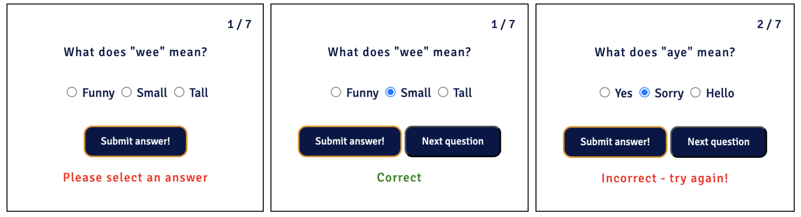
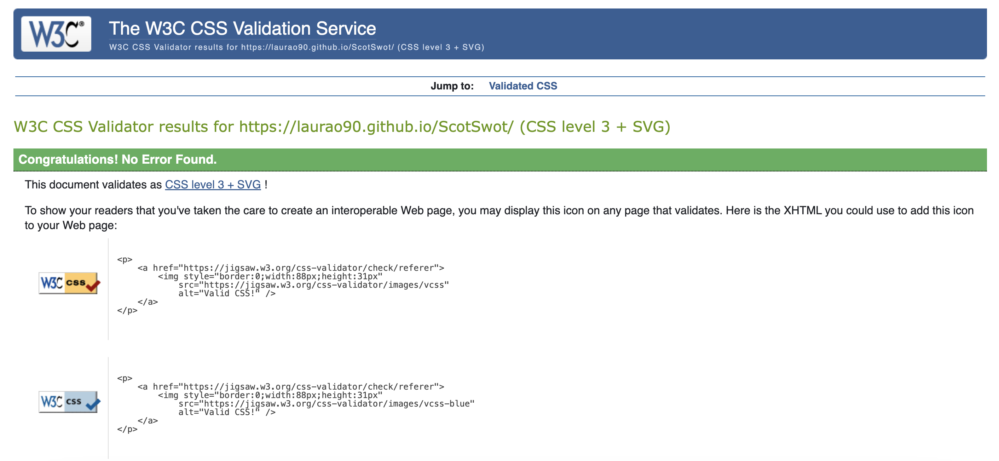
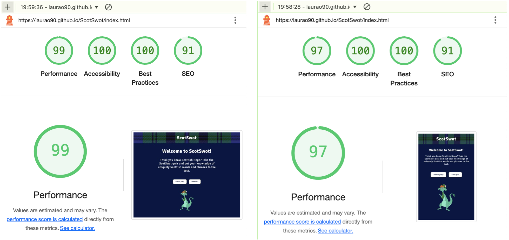

# ScotSwot

## Overview of project ##

Welcome to ScotSwot! ScotSwot is an interactive quiz site that engages users by providing a fun and entertaining quiz based on Scottish words and phrases. 

## Initial planning - UX and UI ##
Prior to developing the website, I considered a variety of key features that would be integral to the success of ScotSwot - both in terms of aesthetics and functionally. The majority of these initial ideas have been implemented and some have evolved through the development process. 

### UX ###
ScotSwot has been developed using the "mobile first" principle to ensure mobile users have an excellent experience. Considerations and updates were implemented to maximise the use of space available on larger screens by using media queries to again provide an excellent experience for users on any device. Google Developer tools were used at every stage of the process to view the UX on mobile, tablet and larger laptop and desktop screens to maximise the experience for all users:

### User Stories ###

1. As a first-time visitor, I want to take a quiz to test my knowledge on Scottish words and phrases.
2. As a first time visitor, I want the site to be intuitive and welcoming, so I can easily navigate the quiz and begin playing.
3. As a first-time visitor or returning user, I want to be able to play the quiz on different devices.
4. As a first time or returning user, I want clear instructions about how to play the quiz.
5. As a first time or returning user, I want to be able to select the level of difficulty so I can further test my knowledge and challenge myself. 
6. As a first time or returning user, I want to receive feedback to know if I have answered correctly or incorrectly.
7. As a first time or returning user, I want to have the ability to try quiz questions again if I give an incorrect answer to learn the correct answer.
8. As a first time or returning user, I want two know what question I am on and how many are left.
9. As a first time or returning user, I want to receive a final score at the end of the quiz to see my performance. 
10. As ScotSwot, I want to create a fun and engaging quiz that entertains users and endears them to the Scottish language and culture. 
11. As ScotSwot, I want to create a site accessible to all users to ensure inclusivity and allow the quiz to grow in reach and popularity.

## Design ##

### Colour Scheme ###

The colour scheme for Scotswot was selected to ensure readability and accessibility. Dark navy is the primary colour to reflect the blue tones associated with Scotland. CSS variables were used to avoid repetition and enhance maintainability (the primary navy colour being —scotswot-blue). I considered the use of a lighter blue to be more recognisable with the Scottish flag but felt this could be overpowering and distracting. The navy background is complemented with white text, but interactive  elements e.g. the dialog instructions and the quiz itself have a white background and navy (—scotswot-blue) text to provide an effective contrast against the main background. 

Colours used:
- **#0a1547** - for main background and some text elements in dialog and quiz container
- **#ffffff** - for heading, main text elements and background of dialog instructions and quiz container
- **#808080** for opaque dialog overlay 

### Typography ###

A Google Font was selected for Scotswot: **Signika**. This was used for all text elements to ensure consistency and clarity. The font is sans-serif without flourishes to provide style and functionality. I researched a variety of fonts and selected this one for its readability and accessibility whilst also being aesthetically pleasing. 

### Images ###

The imagery used in ScotSwot creates a visually appealing experience that captivates users and enhances the Scottish theme. I wanted to ensure the quiz itself is the main focus of the users attention, therefore images have been used thoughtfully and sparingly. 

A digital tartan was used for the header background. Tartan is quintessentially Scottish and instantly recognisable across the world. I searched through a variety of tartans to ensure the chosen tartan compliments the “scotswot-blue” background. Additionally many of the tartans available had strong patterns with white details which were avoided to ensure the ScotSwot header was clear and legible. The chosen tartan looks aesthetically pleasing in the header space without being overpowering.

A cartoon image of the Loch Ness Monster was used to add some fun to the site for users. The image is colourful without being distracting and works well with the overall colour scheme and subtle greens in the tartan header. The image comes with detailed alternative text descriptions, offering context for users who use screen readers.

## Features ##

ScotSwot offers an engaging online platform with clear information and interactive buttons. The overall quiz offers a smooth user experience across devices and screen sizes through its responsive design. 

### Favicon ###
A Favicon was added to help users identify the website in their browser. The Scotland flag emoji was selected to reflect the Scottish theme.

### Header ###
ScotSwot features a header with the site's title and the tartan image background. The header has a clickable link which allows users to easily refresh the page.

### Introduction ###
ScotSwot contains a introduction which welcomes users to the site and provides them with a concise description of what to expect from the quiz. The introduction gives a clear invitation to take the quiz, encouraging users to get started.

The introduction is followed by two buttons. All buttons inluding the two first seen by users have been designed to contrast with the background colour. They have also been rounded to make them more aesthetically pleasing and provide users with a positive experience when using these functions. 

### Quiz Instructions ###
ScotSwot features two initial buttons, the first users encounter is the "How to play?" button. Upon clicking, a modal (created via the dialog element), appears with a clear set of instructions. This is essential for first-time users, and as a refresh for returning users to ensure they feel ready to begin the quiz. To avoid the main background causing distraction, an opaque effect has been used to blur this while the instructions are read by the user. 

### Difficulty Selection ###
ScotSwot lets users initiate and control actions by providing three difficulty levels for the quiz: Easy, Medium and Hard. This enhances site users enjoyment by allowing them to either choose a quiz difficulty level based on their current knowledge, or challenge themselves with a more difficult option. 

### ScotSwot Quiz ###

### Future Implementations ###
Possible upgrades I would like to implement include:
- Incorporate the use of animations, for example a celebratory animation when users get a correct answer or receive a perfect final score to enhance their experience.
- Incorporate sharing possibilities to allow users to share their scores and achievements via messaging apps or social media. This would enhance the users experience and could encourage others to visit the site and enjoy the quiz. 

## Testing ##
Testing was used throughout the entirety of the Scotswot project. Every HTML, CSS and Javascript change or experiment was checked in the browser to monitor UX, the functionality and aesthetics of each page. With each change, Google Developer tools were used to test changes across mobile, tablet and larger laptop and desktop screens (see UX section).

### Validator Testing ### 
- **HTML**
    - W3C Validator returned an error message relating to the use of a section element without a heading and suggested using a div element instead. This was amended and fixed in this commit: [Commit section fix](https://github.com/LauraO90/ScotSwot/commit/4ab53bd76cdfd9716e1fb070e31ae59ce2861074). No errors were returned when retested and no other errors were returned when passing through the W3C validator.

- **CSS**
    - No errors were returned when passing through the Jigsaw validator.

- **JavaScript**
    - Early in the development if Scotswot, JSHint returned feedback regarding unused code which was removed immediately. Since then, JSHint returned no errors but highlighted six unused varables. These variables are however essential and are called via onclick events in the index.html file.  

### Browser Testing ### 

- ScotSwot has been tested and works successfully across various browsers including Google Chrome, Microsoft Edge and Safari. It has been tested across various devices including smartphone, laptop and desktop devices. 

### General Fixes ###
- During the process of developing ScotSwot, some bugs were encountered and addressed. The quiz was giving incorrect feedback to a correct answer and fixed in this commit: [Commit feedback fix](https://github.com/LauraO90/ScotSwot/commit/7d46346fa3c56209162411e376a34c1980444686).

- When reviewing the quiz I observed the radio buttons remained checked when the user moved to the next question. This was amended and fixed in this commit: [Commit uncheck radio button fix](https://github.com/LauraO90/ScotSwot/commit/e01eeccf13e0156c826c499ea74c2062bc661994#diff-4698a0d6946cc7eab0ee49f1773e6bfa66a91c8c1ae37b2587b9dc9ebdf47247).

### Lighthouse Audit ###
- I ran Lighthouse on my project and the results were consistently between 91-100% for Perfromance, Accessibility, Best Practices and SEO.
- The header and Nessie image were updated to improve sizing and Performance. 

## Deployment ##

ScotSwot was created using Gitpod Enterprise and the site was deployed to Github pages: [ScotSwot deployment](https://laurao90.github.io/ScotSwot/)

### Deployment to GitHub Pages ###

The steps to deploy are as follows:

- In the [GitHub repository](https://github.com/LauraO90/ScotSwot), navigate to the Settings tab.
- From the source section drop-down menu, select the Main Branch, then click "Save".
- The page will be automatically refreshed with a detailed ribbon display to indicate the successful deployment.

### Clone from Github ###

The steps to clone this repository are as follows:

- On the repository's GitHub page, click on the "Code" button.
- In the dropdown, click on "Clone" to copy the repository's URL to your clipboard.
- Open your Terminal or Git Bash.
- Navigate to the directory where you want to clone the repository.
- In your IDE Terminal, use the git clone command (- `git clone) followed by the URL you copied earlier to create your local clone.

### Fork from Github ###

The steps to fork this repository are as follows:

- On the repository's GitHub page, click on the "Fork" button at the top-right corner.
- Once forked, the repository will be available under your GitHub account.

## Credits ##

### Tools and Tech Used ###

[GitPod Enterprise](https://www.gitpod.io/) used for coding and developing ScotSwot. 

[GitHub](https://github.com) used for online code storage and deployment.

[CSS :root variables](https://www.w3schools.com/css/css3_variables.asp) used for frequently used styling.

[Dialog element](https://blog.webdevsimplified.com/2023-04/html-dialog/) used to create accessible modal for quiz instructions. 

[Google Fonts](https://fonts.google.com/) used for more appealing font options.

[Tartanify](https://tartanify.com/) used for tartan pattern on header. 

[Imgbin](https://imgbin.com/) used for cartoon image. 

[Favicon](https://favicon.io/emoji-favicons/flag-scotland) used for favicon emoji. 

[Am I Responsive](https://ui.dev/amiresponsive) used to check responsiveness alongside Google Developer tools. 

## Acknowledgements ##  
I would like to thank my Code Institute mentor Chris Quinn for their support and guidance during this project. 